

  <h1>Hola, soy Aarón Gómez Abella 👋</h1>
  <h3>🛡️ DevSecOps | Desarrollo & Ciberseguridad</h3>
  
Oviedo, Asturias 🇪🇸

  

    Técnico híbrido con <b>+15 años de experiencia</b> en soporte y administración de sistemas, evolucionando hacia el <b>Desarrollo Seguro (DevSecOps)</b>. 
    Combino una base sólida en infraestructuras críticas con nuevas competencias en desarrollo de software.
  

  

  
  

### 🎓 Formación Académica

* **Máster en Ciberseguridad** | ThePower Education *(Actualidad)*
* **FP Desarrollo de Aplicaciones Multiplataforma (DAM)** | ThePower Education *(Actualidad)*
* **FP Superior en Administración de Sistemas Informáticos en Red (ASIR)** | Colegio Sagrada Familia El Pilar

---

  <h3>🚀 Stack Tecnológico</h3>
  
Herramientas y lenguajes que utilizo en mi día a día

  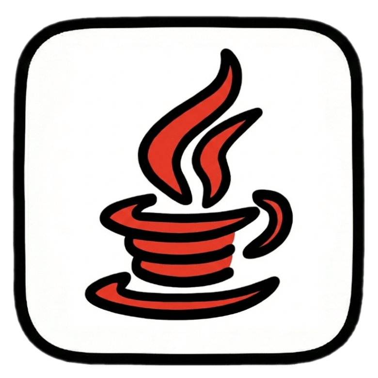
  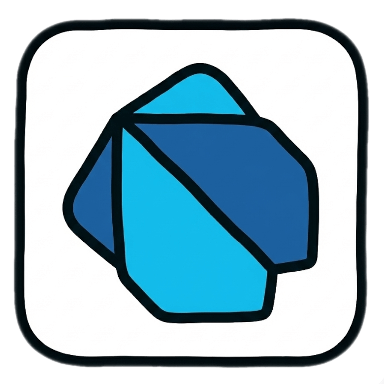
  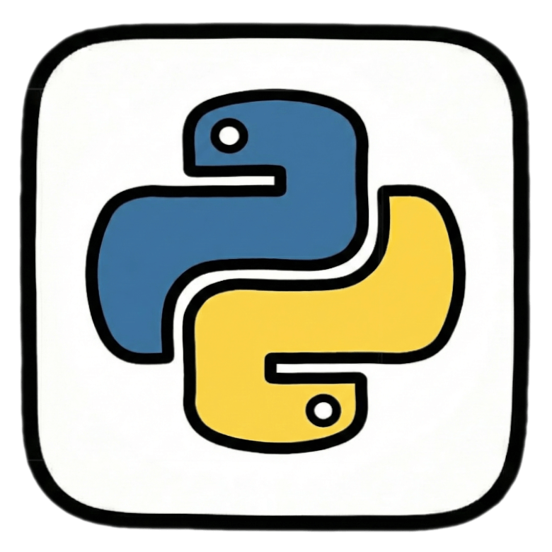
  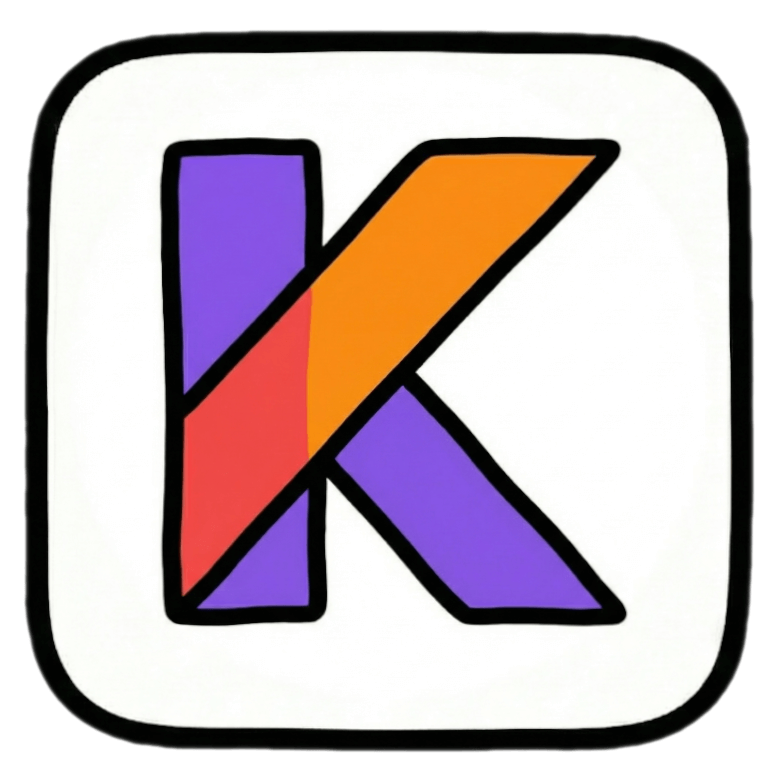
  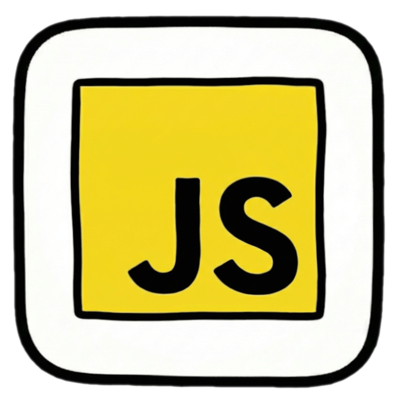
    
  
  
  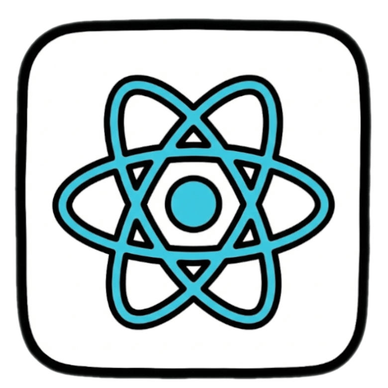
  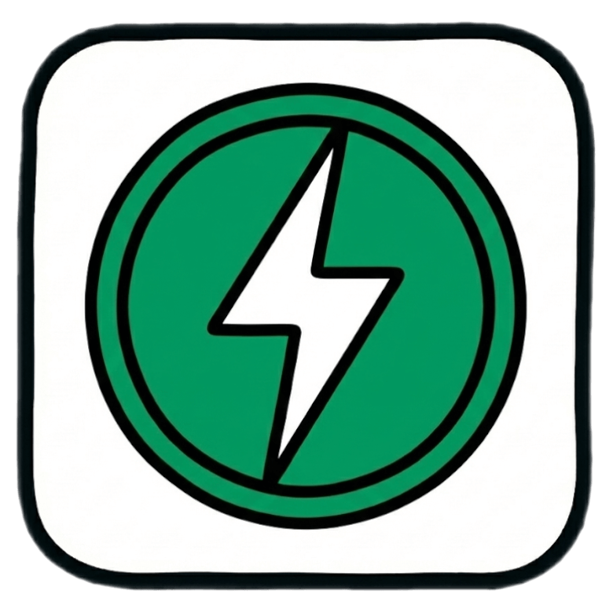
  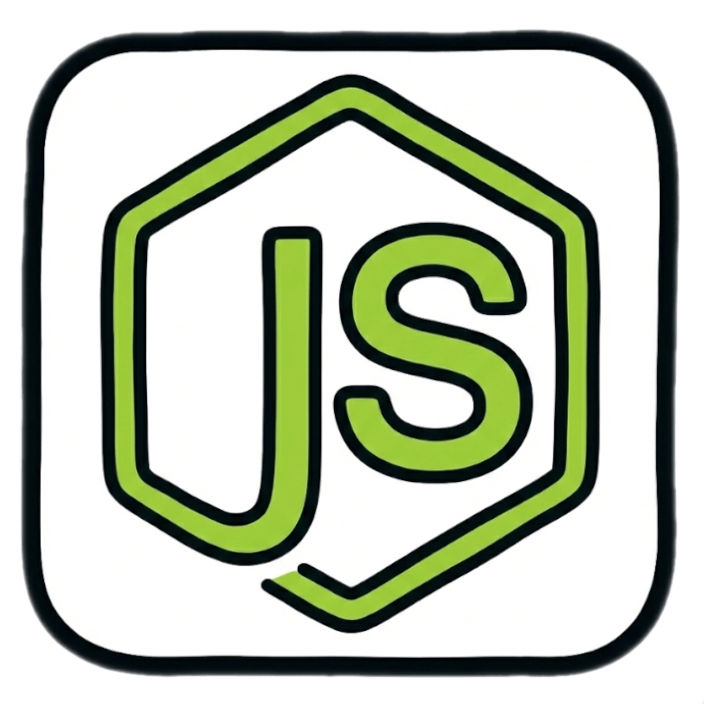
   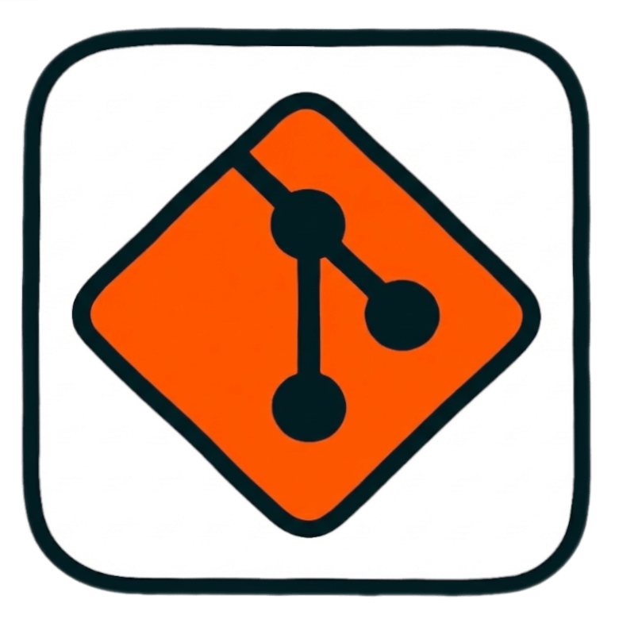
  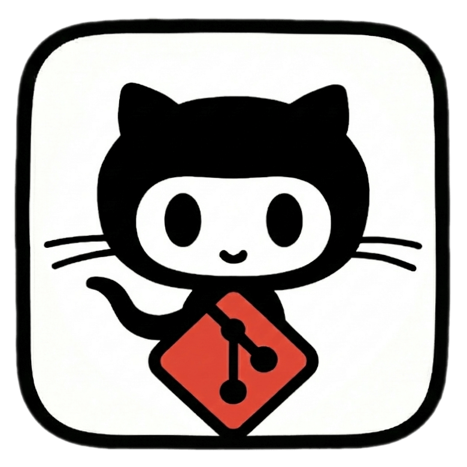
 
    

  
  
  
  
  
    

  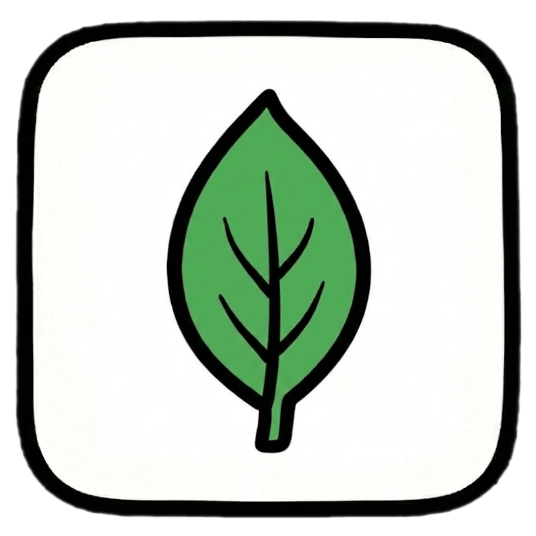
  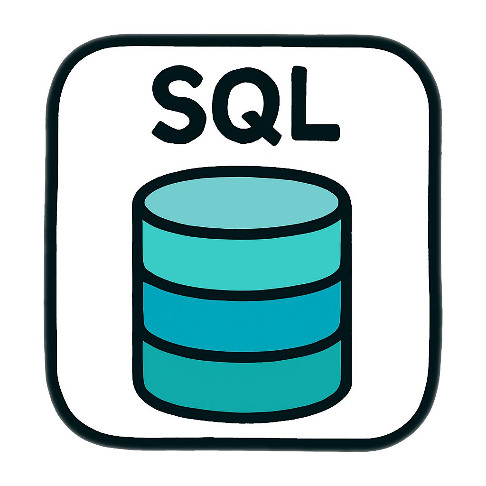

---

### 🔭 Proyectos en Curso
Actualmente aplicando conocimientos en productos reales:

* 📱 **Desarrollo Flutter:** Creación de un **Software TPV** completo y un **videojuego de plataformas** utilizando el motor **Flame**.
* 🎮 **Game Dev:** Colaboración activa en el desarrollo de un videojuego utilizando **Godot Engine**.

---

### 📜 Certificaciones Destacadas

* **Cisco:** CCST Cybersecurity, Cyber Threat Management, Network Defense & Endpoint Security.
* **Azure** AI-900: Microsoft Certified: Azure AI Fundamentals
* **Python Essentials 1 & 2** (Cisco Networking Academy).
* **Microsoft Azure:** AZ-900, AZ-104, AZ-400 (DevOps Engineer Expert).

---

### 🖥️ Mi Laboratorio (Setup & Infraestructura)

Hardware dedicado para desarrollo, compilación y **Self-Hosting**:

| Componente | Workstation (MiniPC) | Portátil (HP) | Home Server (RPi 5) |
| :--- | :--- | :--- | :--- |
| **CPU** | Ryzen 9 6800HX (8c/16t) | Ryzen 7 7730U (8c/16t) | Broadcom BCM2712 (4c) |
| **RAM** | 32GB DDR5 (5600 MHz) | 32GB DDR4 (3200 MHz) | 8GB LPDDR4X |
| **GPU / Disco** | ATI Radeon 680M (4GB) | ATI Radeon Graphics | NVMe 256GB (Pimoroni) |

#### 🏠 Server Project (Linux PiOS)
Administración de servidor propio para despliegue seguro y persistencia de datos:
* **🔒 Seguridad & Redes:** Acceso remoto garantizado mediante redireccionamiento **DDNS seguro**, certificado **SSL autorenovable** y gestión de tráfico con **Firewall** configurado.
* **🐳 Despliegue Docker:** Entorno containerizado para la ejecución de **Odoo** y aplicaciones propias.
* **💾 Backend:** Alojamiento centralizado de **Bases de Datos** para dar servicio a mis aplicaciones móviles y de escritorio.
